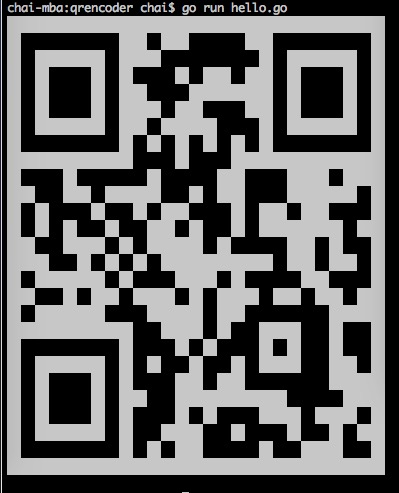

## Encode QRCode

```go
import (
	qr "github.com/chai2010/image/qrencoder"
)

func main() {
	c, err := qr.Encode("hello, world", qr.L)
	if err != nil {
		log.Fatal(err)
	}

	err = ioutil.WriteFile("zz_qrout.png", c.PNG(), 0666)
	if err != nil {
		log.Fatal(err)
	}
}
```

## Show QRCode in terminal

```go
import (
	ximage "github.com/chai2010/image"
	qr "github.com/chai2010/image/qrencoder"
)

func main() {
	sqrcode, err := MakeTerminalQrCodeImage("https://github.com/chai2010", qr.L)
	if err != nil {
		log.Fatal(err)
	}
	fmt.Println(sqrcode)
}

func MakeTerminalQrCodeImage(text string, level qr.Level) (string, error) {
	c, err := qr.Encode(text, qr.L)
	if err != nil {
		return "", err
	}

	m := &codeImage{Code: c}

	framebuffer := ximage.NewStringImage(
		image.Rect(0, 0, c.Size+2, c.Size+2),
		ximage.MakeTerminalGrayModel(),
	)
	draw.Draw(
		framebuffer, image.Rect(1, 1, c.Size+1, c.Size+1),
		m, image.Pt(0, 0),
		draw.Over,
	)

	s := framebuffer.ToString(ximage.TerminalColor_WHITE)
	return s, nil
}

type codeImage struct{ *qr.Code }

func (c *codeImage) Bounds() image.Rectangle { return image.Rect(0, 0, c.Size, c.Size) }
func (c *codeImage) ColorModel() color.Model { return color.GrayModel }

func (c *codeImage) At(x, y int) color.Color {
	if c.Black(x, y) {
		return color.Gray{0x00} // blackColor
	}
	return color.Gray{0xFF} // whiteColor
}
```


